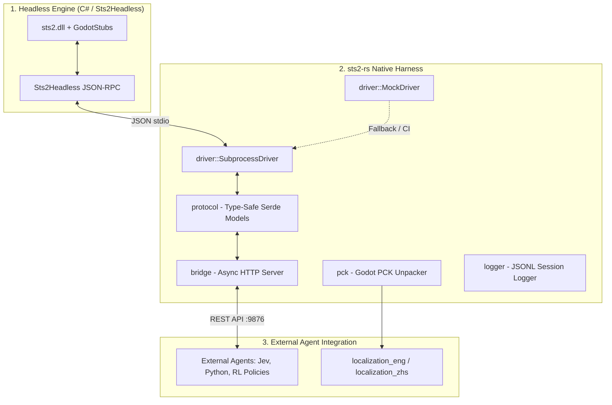

# sts2-rs

[](https://github.com/solidsf-inc/sts2-rs/actions)
[](https://opensource.org/licenses/MIT)
[](https://www.rust-lang.org/)

**High-performance, zero-Python Rust harness, HTTP bridge daemon, and PCK unpacker for Slay the Spire 2.**

Designed as a drop-in replacement for the Python-dependent tooling in [sts2-cli](https://github.com/wuhao21/sts2-cli). It provides a native compiled execution harness and REST bridge so developers can connect external agents (such as Jev, reinforcement learning models, or custom scripts) to Slay the Spire 2 with sub-millisecond IPC latency and compile-time type safety.

---

## Overview

- **Zero Python Dependencies**: Replaces legacy Python scripts (`sts2_bridge.py`, `extract_localization.py`, `game_log.py`) with native compiled Rust binaries.
- **Native PCK Unpacker (`sts2-pck`)**: High-speed Godot PCK v2 and v3 archive extractor with streaming MD5 checksum verification.
- **High-Throughput HTTP Bridge (`sts2-bridge`)**: Multithreaded REST server replacing Python `http.server`, eliminating port contention, zombie processes, and IPC deadlocks.
- **External Agent Compatibility**: Native JSON API designed for low-latency decision agents, including TypeSafe AI's Jev models, Python bots, and RL policies.
- **Headless Process Driver**: Type-safe Serde serialization for C# `Sts2Headless` stdio JSON-RPC protocol.

---

## Architecture



---

## Binaries and CLI Tools

| Binary | Description |
|---|---|
| `sts2-bridge` | Native HTTP REST daemon connecting external agents (e.g. Jev, Python scripts, RL models) to STS2. |
| `sts2-pck` | High-speed Godot PCK binary archive extractor and checksum validator. |

---

## Installation and Quickstart

### Prerequisites
- [Rust toolchain](https://rustup.rs/) (1.75+)
- Optional: [.NET 9+ SDK](https://dotnet.microsoft.com/) (required only when running against the live licensed game engine)

### Build
```bash
git clone https://github.com/solidsf-inc/sts2-rs.git
cd sts2-rs
cargo build --release
```

Binaries are compiled into `target/release/`.

---

## Usage

### 1. Start Native HTTP Bridge (`sts2-bridge`)

Start the REST bridge daemon on port `9876`:
```bash
cargo run --release --bin sts2-bridge -- --port 9876
```

CLI Options:
```text
Options:
  -p, --port <PORT>  Port to listen on [default: 9876]
      --root <ROOT>  Path to sts2-cli root directory [default: ..]
      --mock         Force mock simulation mode
  -h, --help         Print help
```

#### Connecting External Agents (Jev, Python, RL Models)
External models communicate directly with `sts2-bridge` via HTTP POST:

1. **Start a Run**:
```bash
curl -X POST http://localhost:9876 \
  -H "Content-Type: application/json" \
  -d '{"cmd": "start_run", "character": "Necrobinder", "ascension": 0}'
```

2. **Execute Actions**:
Pass actions determined by your external model. The bridge returns the updated structured `GameState` JSON synchronously:
```bash
# Play card index 0 targeting enemy index 0
curl -X POST http://localhost:9876 \
  -H "Content-Type: application/json" \
  -d '{"cmd": "action", "action": "play_card", "args": {"card_index": 0, "target_index": 0}}'

# End turn
curl -X POST http://localhost:9876 \
  -H "Content-Type: application/json" \
  -d '{"cmd": "action", "action": "end_turn"}'

# Select card reward
curl -X POST http://localhost:9876 \
  -H "Content-Type: application/json" \
  -d '{"cmd": "action", "action": "select_card_reward", "args": {"card_index": 0}}'

# Navigate map node
curl -X POST http://localhost:9876 \
  -H "Content-Type: application/json" \
  -d '{"cmd": "action", "action": "select_map_node", "args": {"col": 1, "row": 1}}'
```

Because `sts2-bridge` returns structured game state in $< 1$ millisecond, low-latency decision agents such as Jev experience zero IPC overhead.

### 2. PCK Archive Extraction (`sts2-pck`)

Extract and verify game localization tables directly from the official Godot PCK package:
```bash
cargo run --release --bin sts2-pck -- /path/to/game.pck --root /path/to/sts2-cli
```

---

## Testing

Execute the test suite:
```bash
cargo test
```

Execute linter checks:
```bash
cargo clippy --all-targets -- -D warnings
```

---

## License

MIT License. See [LICENSE](LICENSE) for details.
